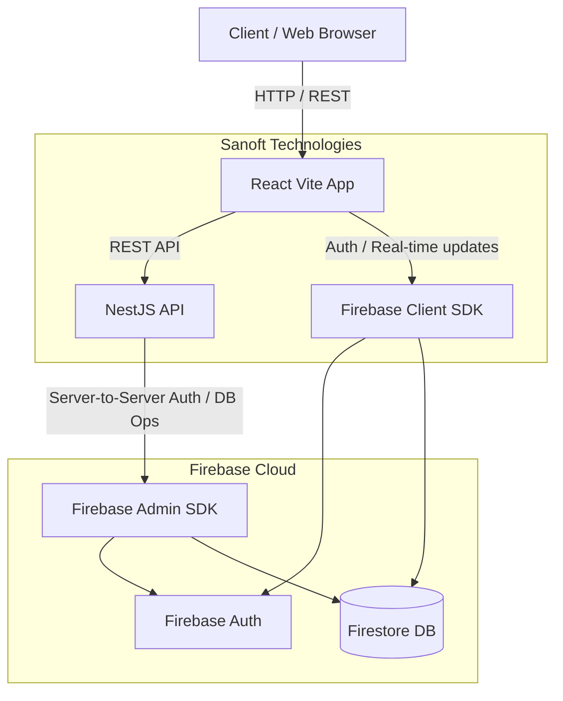

# Sanoft Technologies

## Project Overview
Sanoft Technologies is a modern, full-stack web application. It features a React-based frontend for a rich user interface and a NestJS-powered backend for robust API services, all seamlessly integrated with Firebase for authentication and database management.

## Architecture



- **Frontend**: Built with **React 19** and **TypeScript** using **Vite** for fast bundling. It uses **Zustand** for state management, **React Router** for navigation, and **Firebase** Client SDK. UI components include **Recharts** for data visualization and **Lucide React** for icons.
- **Backend**: Built with **NestJS** and **TypeScript**, utilizing the **Firebase Admin SDK** to securely interact with Firebase services.
- **Database / Auth**: **Firebase** (Firestore/Authentication).
- **Structure**: Monorepo with isolated `frontend` and `backend` directories.

## Setup & Local Development Instructions

### Prerequisites
- Node.js (v18 or higher)
- npm or yarn
- A Firebase project set up

### Frontend Setup
1. Navigate to the frontend directory:
   ```bash
   cd frontend
   ```
2. Install dependencies:
   ```bash
   npm install
   ```
3. Start the Vite development server:
   ```bash
   npm run dev
   ```

### Backend Setup
1. Navigate to the backend directory:
   ```bash
   cd backend
   ```
2. Install dependencies:
   ```bash
   npm install
   ```
3. Start the NestJS development server:
   ```bash
   npm run start:dev
   ```

## Environment Variable Documentation

### Frontend (`frontend/.env`)
Create a `.env` file in the `frontend` directory with your Firebase configuration:
```env
VITE_FIREBASE_API_KEY=your_api_key
VITE_FIREBASE_AUTH_DOMAIN=your_project_id.firebaseapp.com
VITE_FIREBASE_PROJECT_ID=your_project_id
VITE_FIREBASE_STORAGE_BUCKET=your_project_id.appspot.com
VITE_FIREBASE_MESSAGING_SENDER_ID=your_sender_id
VITE_FIREBASE_APP_ID=your_app_id
VITE_API_BASE_URL=http://localhost:3000 # Your NestJS backend URL
```

### Backend (`backend/.env`)
Create a `.env` file in the `backend` directory. You will likely need Firebase Admin credentials here:
```env
PORT=3000
FIREBASE_PROJECT_ID=your_project_id
FIREBASE_CLIENT_EMAIL=your_client_email
FIREBASE_PRIVATE_KEY="your_private_key"
```

## Deployment Steps

### 1. Frontend Deployment (e.g., Vercel, Netlify, Firebase Hosting)
- **Firebase Hosting (Recommended since you use Firebase)**:
  - Run `firebase init hosting` in the `frontend` folder.
  - Set the public directory to `dist`.
  - Set it as a single-page app (rewrite all URLs to `/index.html`).
  - Run `npm run build` then `firebase deploy --only hosting`.
- **Vercel/Netlify**:
  - Connect your GitHub repository.
  - Set the Root Directory to `frontend`.
  - Build command: `npm run build`
  - Output directory: `dist`
  - Add all the `VITE_` environment variables in the hosting dashboard.

### 2. Backend Deployment (e.g., Render, Railway, Google Cloud Run)
- Connect your GitHub repository to your chosen platform.
- Set the Root Directory to `backend`.
- Build Command: `npm run build`
- Start Command: `npm run start:prod`
- Add all backend environment variables (`FIREBASE_PRIVATE_KEY`, etc.) in the hosting dashboard.

## Live URLs
- **Frontend Live URL**: *(Add your live frontend URL here after deployment)*
- **Backend Live URL**: *(Add your live backend API URL here after deployment)*
